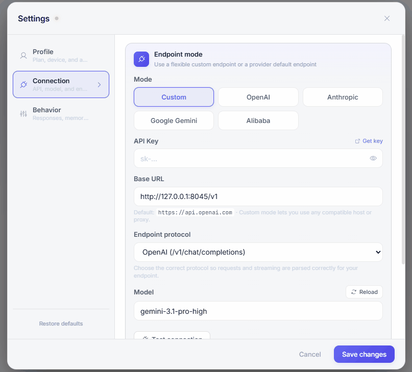
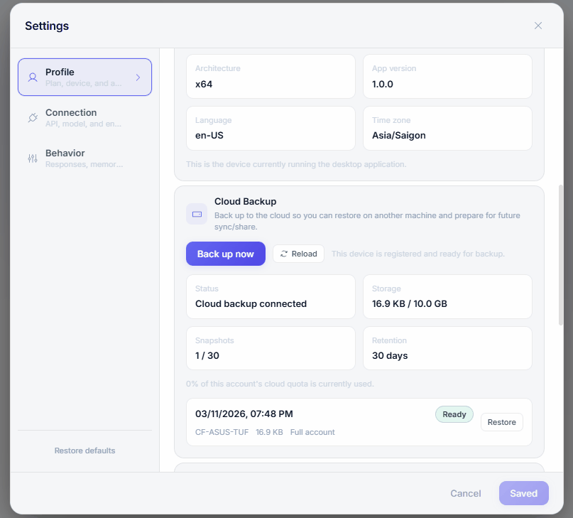
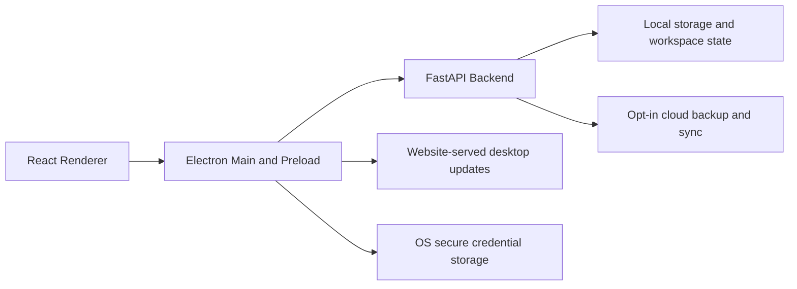

<p align="center">
  
</p>

<h1 align="center">PigTex Desktop</h1>

<p align="center">
  <strong>Desktop AI workstation for focused chat, workspace memory, secure credentials, and release-grade Windows delivery.</strong>
</p>

<p align="center">
  Electron + React renderer, FastAPI backend, website-served desktop updates, and a public repository curated specifically for desktop contributors.
</p>

<p align="center">
  <a href="https://github.com/ctex-ai/PigTex/releases/latest">
    
  </a>
  <a href="https://github.com/ctex-ai/PigTex/actions/workflows/ci.yml">
    
  </a>
  <a href="./LICENSE">
    
  </a>
  
  
  
  
</p>

<p align="center">
  <a href="https://github.com/ctex-ai/PigTex/releases/latest"><strong>Download Latest Release</strong></a>
  ·
  <a href="./.github/CONTRIBUTING.md"><strong>Contributing</strong></a>
  ·
  <a href="./.github/SECURITY.md"><strong>Security</strong></a>
  ·
  <a href="./docs/trust-policy.md"><strong>Trust Policy</strong></a>
</p>

<p align="center">
  <a href="https://texapi.dev" target="_blank" rel="noopener noreferrer">
    
  </a>
</p>

<p align="center">
  <sub><strong>Integrated partner:</strong> <a href="https://texapi.dev" target="_blank" rel="noopener noreferrer">TexAPI</a> is an API gateway provider that gives PigTex access to a broad model catalog through a single API key, with managed routing and BYOK-friendly endpoint control.</sub>
</p>

> [!IMPORTANT]
> This repository is the public desktop-only source tree for PigTex.
> It intentionally excludes the marketing website, deployment infrastructure, private prompt/data packs, local databases, packaged installers, and all real secrets.

## Why PigTex

<table>
  <tr>
    <td width="33%" valign="top">
      <strong>Workspace-aware memory</strong><br />
      System rules and workspace rules can be kept separate so longer-running desktop work stays organized.
    </td>
    <td width="33%" valign="top">
      <strong>Flexible model routing</strong><br />
      Connect through TexAPI or switch to direct providers with user-managed endpoints, models, and credentials.
    </td>
    <td width="33%" valign="top">
      <strong>Desktop-native release flow</strong><br />
      Windows packaging, release staging, and production-safe desktop delivery are part of the public tree.
    </td>
  </tr>
  <tr>
    <td width="33%" valign="top">
      <strong>Privacy-conscious defaults</strong><br />
      Secure local credential storage is used on supported platforms, and cloud backup remains opt-in.
    </td>
    <td width="33%" valign="top">
      <strong>Bilingual product surface</strong><br />
      Core desktop flows are built for Vietnamese and English users instead of shipping placeholder localization.
    </td>
    <td width="33%" valign="top">
      <strong>Public-repo discipline</strong><br />
      Community docs, release guards, and a curated file tree keep the repository presentable for external readers.
    </td>
  </tr>
</table>

## Product Tour

<table>
  <tr>
    <td width="50%" valign="top">
      
      <strong>Focused chat workflow</strong><br />
      A desktop-first assistant surface built for longer sessions instead of throwaway prompts.
    </td>
    <td width="50%" valign="top">
      
      <strong>Workspace and file context</strong><br />
      Local project context, editor flow, and structured desktop work stay inside one app.
    </td>
  </tr>
  <tr>
    <td width="50%" valign="top">
      
      <strong>Endpoint and model control</strong><br />
      Switch between TexAPI and direct providers with user-managed credentials and endpoints.
    </td>
    <td width="50%" valign="top">
      
      <strong>Opt-in backup and sync</strong><br />
      Cloud backup stays explicit, visible, and separate from local-first desktop usage.
    </td>
  </tr>
</table>

## Architecture



## Quick Start

### 1. Install the renderer

```powershell
npm ci
Copy-Item .env.example .env
```

### 2. Install the backend

```powershell
cd backend
python -m venv venv
.\venv\Scripts\pip.exe install -r requirements.txt
Copy-Item .env.example .env
```

Use `.env.example` in the repository root for the renderer and `backend/.env.example` for the backend.

### 3. Run the core checks

```powershell
npm run lint:security
npm test
npm run build:electron
cd backend
venv\Scripts\python.exe -m unittest discover -s tests -v
```

## Release Workflow

Stable release builds target the production backend root. Before packaging, set:

```powershell
$env:VITE_PIGTEX_API_BASE='https://pigtex.id.vn'
```

Then run:

```powershell
npm run build:win:release
npm run release:stage
```

- `build:win:release` creates the stable Windows installer in `/release`
- `release:stage` stages the stable `.exe` and matching `.blockmap` for the production download host
- Stable packaged builds check the hosted desktop manifest and open the website download flow when a newer installer is available

## Repository Layout

| Path | Purpose |
| --- | --- |
| `src/` | React renderer UI and desktop-facing frontend logic |
| `electron/` | Electron main-process and preload code |
| `backend/` | FastAPI backend used by the desktop app |
| `assets/` | Source-managed logos and desktop assets |
| `public/` | Public runtime assets served by Vite |
| `scripts/build/` | Packaging helpers, RCEdit utilities, and build guards |
| `scripts/release/` | Release staging, validation, and GitHub publish helpers |
| `scripts/signing/` | Windows signing hooks and GA signing validation |
| `scripts/dev/` | Local development launch helpers |
| `docs/` | Public-safe trust and contributor-facing documentation |

## Public Repo Scope

This repository includes:

- Electron renderer and main-process code
- FastAPI backend used by the desktop app
- Public-safe docs, tests, build configs, and example environment files

This repository does not include:

- Website and download-manifest source
- `deploy/`, `ops/`, or other private infrastructure material
- Real `.env` files, local databases, logs, `node_modules`, or packaged installers
- Private prompt/data packs and internal operating material

<details>
  <summary><strong>Optional private prompt packs</strong></summary>

This public repo can run without the private prompt/data packs. If you keep those packs outside the repo, point the backend at them with:

```powershell
PIGTEX_DATA_DIR=
PIGTEX_PROMPT_PACKS_DIR=
PIGTEX_SKILL_FOUNDRY_DIR=
```

- `PIGTEX_DATA_DIR` or `PIGTEX_PROMPT_PACKS_DIR`: external directory that contains `system_prompts/`, `enhancement_rules/`, and related JSON packs
- `PIGTEX_SKILL_FOUNDRY_DIR`: external prompt-catalog storage directory

If these variables are not set, the backend degrades safely and uses local per-device storage where needed.

</details>

## Community and Trust

- [Contributing guide](./.github/CONTRIBUTING.md)
- [Security policy](./.github/SECURITY.md)
- [Code of conduct](./.github/CODE_OF_CONDUCT.md)
- [Trust policy](./docs/trust-policy.md)
- [Latest release](https://github.com/ctex-ai/PigTex/releases/latest)

## License

Licensed under [MIT](./LICENSE).
